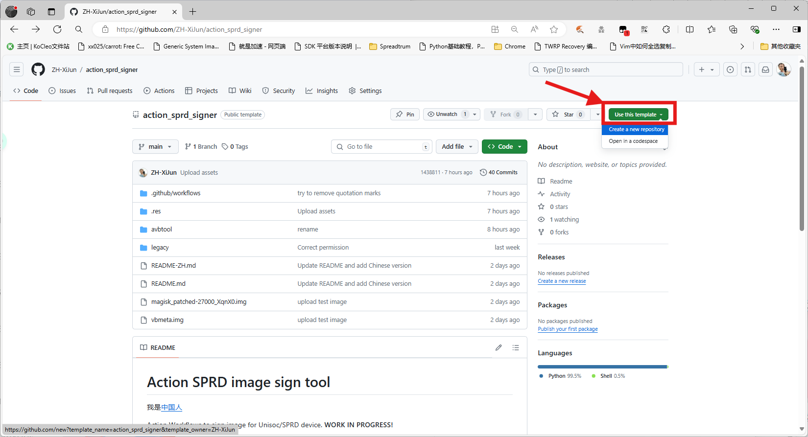

# Action SPRD image sign tool

一个给紫光展锐（下文叫它展讯）设备自动签名镜像的Github工作流。**还没写完！！！**

# 介绍

据我所知，展讯现在用了两种签名方法。请根据你的SoC型号选择正确的方法签名

## AVBTOOL签名大法

> [!Caution]
> avbtool签名大法没写完，要签的话自己看[这个教程](https://www.hovatek.com/forum/thread-32664.html)和[这个教程](https://www.hovatek.com/forum/thread-32674.html)

Avbtool，顾名思义，就是处理avb2.0（或者avb1.0也行？）镜像用的。avbtool签名大法就是用avbtool给你的镜像签名。可以看[这个](https://www.hovatek.com/forum/thread-32664.html)和[这个](https://www.hovatek.com/forum/thread-32674.html)教程来了解签名的原理。

打个比方，**SC9832E/SL8541E**就得用这个方法签名，因为它采用了Android启动时验证2.0（就是avb2.0）来验证镜像。

如果我没猜错的话，你这设备有vbmeta分区而且不是空的，那十有八九得用这方法了。

如果想进一步确认的话，可以检查下boot和vbmeta的文件头。boot的文件头跟正常Android没啥区别（前8个字节是`ANDROID!`），但是vbmeta就被爆改了（前四个字节是`DHTB`），avbtool就读不了vbmeta了。实际上，真正的文件头被后移了512字节。

## sprd_sign签名大法

或者说，额，Legacy签名大法？我觉得“sprd_sign签名大法”更贴切一点。这种方法似乎是用在老SoC上的。展讯有他们自己的签名工具。

举个栗子啊，**SC9820E/SL8521E**就用了这种办法。可能是因为大多数9820e都用了安卓4.4，所以用不到那么先进的avb2.0，但是还是有些9820e 8.1的啊（

如果我没猜错的话，你这设备没vbmeta分区，或者vbmeta分区是空的，那十有八九得用这方法了。

想进一步确认的话，可以检查下boot的文件头。boot的文件头跟上文vbmeta一样被爆改成`DHTB`了，那些boot解包工具找不到`ANDROID!`文件头就炸了（但是magisk为啥正常啊）。实际上，`ANDROID!`也被后移了512字节。vbmeta就没必要看了吧，都没有了看个几把（

# 怎么用

你需要提供你想要签名的 `boot\recovery` 镜像。如果你用avbtool大法，还需要设备里提出来的原版 `vbmeta` 。**VBMETA镜像里的DHTB头不要删掉！！！**

1. **使用`Fork`或`Use this template`以克隆仓库到你的账号里**

2. **把镜像上传到一个能获取文件直链的地方。你可以把你的镜像上传到你的仓库里，然后用"View raw"拿到文件直链**

3. **打开`Actions`页面，然后选择一个合适的工作流。读读上面的[介绍](#介绍)能帮你选择到正确的工作流**

4. **按下`Run workflow`按钮，然后把参数都填上**

- 如果你用的是`Sign image (Legacy)`，你只用填一个参数就行了。

- 但如果是`Sign image (avbtool)`，那要填的可就多了

- 可能有人不会填第四个参数，这里笔者给个办法，就是回读一下boot/recovery分区，然后把提出来的文件的大小填进去就行了。**如果你操作有误，文件大小可能会发生变化，那样就不准了**

5. **点`Run workflow`之后，啪的一下，很快啊，镜像就签好了。签完的镜像传到Artifacts上了，自行下载即可**

